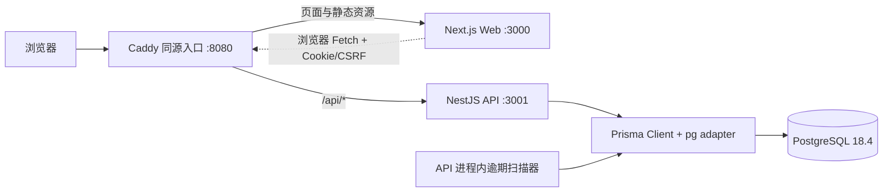

# DSE 升学服务 CRM 技术栈报告

> **报告日期：** 2026-08-03  
> **审计对象：** 当前工作区源码、依赖锁文件、数据库迁移、部署配置、测试与 CI 配置  
> **项目阶段：** S1「任务监督闭环」，目标软件版本 v0.2.0  
> **报告方法：** 以代码和配置的实际使用为准，并与 ADR、README、发布及验收材料交叉核对

## 1. 执行摘要

本项目是面向 DSE 升学服务流程管理的全栈 CRM。系统采用 TypeScript 单体仓库，前后端分离部署、
共享类型与 UI 包；浏览器端使用 Next.js、React 和 Ant Design，服务端使用 NestJS 与 Express，
数据层使用 PostgreSQL 和 Prisma。首版部署基线为 Docker Compose，Caddy 负责同源反向代理。

当前源码已经超出 README 所描述的 S0 技术底座，实际实现了 S1 的学生建档、SOP 版本管理、服务
启用、任务生成与分配、管家执行、延期报备、逾期扫描、管理员监督、任务时间线和审计闭环。

系统的主要技术特征如下：

- 全栈 TypeScript，Node.js 24 运行时；
- pnpm Workspace + Turborepo 管理 2 个应用、4 个公共包和 1 个数据库包；
- REST/JSON API，使用 OpenAPI 作为版本化接口契约；
- PostgreSQL 数据库会话认证，不使用 JWT；
- RBAC 功能权限叠加任务负责人关系权限；
- 事务、乐观锁、幂等回执、快照和审计日志保证关键业务一致性；
- Vitest、Testing Library、Supertest、Playwright 组成分层测试体系；
- GitHub Actions 执行数据库迁移、契约生成、静态检查、测试、构建与 E2E 质量门禁；
- 当前未引入 Redis、消息队列、Kubernetes、对象存储实现或第三方身份平台。

## 2. 系统架构

开发环境中，Next.js 将 `/api/*` 重写到本机 `localhost:3001`；Compose 环境由 Caddy 将 Web 与
API 统一到一个来源，降低 Cookie、CORS 和 CSRF 配置复杂度。系统目前是单机 Compose 架构，
API、定时扫描与限流均按单实例基线设计。

## 3. 仓库组织与工作区

项目使用 pnpm Workspace 管理以下工作区：

| 工作区                | 职责                                       | 主要依赖关系                           |
| --------------------- | ------------------------------------------ | -------------------------------------- |
| `apps/web`            | 管理员端与管家端 Web 应用                  | `api-client`、`config`、`shared`、`ui` |
| `apps/api`            | REST API、认证授权与业务服务               | `database`、`shared`                   |
| `database`            | Prisma Schema、客户端、迁移和种子数据      | PostgreSQL、Prisma、pg                 |
| `packages/shared`     | 角色、权限、错误码、API Envelope、存储端口 | 无运行时外部依赖                       |
| `packages/config`     | 设计 Token                                 | 无运行时外部依赖                       |
| `packages/api-client` | 通用 Fetch 客户端与 OpenAPI 类型生成       | `shared`                               |
| `packages/ui`         | 通用加载、空状态、错误状态等 UI 组件       | React、Ant Design                      |

Turborepo 编排 `dev`、`build`、`lint`、`typecheck`、`test` 和 `test:coverage`；公共包先构建，
API 与 Web 再分别产出 `dist` 和 `.next`。工作区依赖统一使用 `workspace:*`，避免内部包版本漂移。

## 4. 核心技术栈与版本

下表的“解析版本”来自当前 `pnpm-lock.yaml`，而非只引用 `package.json` 中的版本范围。

| 层级          | 技术                          |        当前解析版本 | 用途                                     |
| ------------- | ----------------------------- | ------------------: | ---------------------------------------- |
| 运行时        | Node.js                       |                  24 | 前端构建、API 与脚本运行时               |
| 包管理        | pnpm                          |              11.9.0 | Workspace、依赖锁定、脚本执行            |
| 单仓库编排    | Turborepo                     |              2.10.7 | 跨工作区任务依赖与缓存                   |
| 主语言        | TypeScript                    |               5.9.3 | Web、API、数据库和公共包                 |
| Web 框架      | Next.js App Router            |             16.2.12 | 路由、构建、生产 Web 服务                |
| UI 运行时     | React / React DOM             |              19.2.8 | 组件与客户端状态                         |
| UI 组件库     | Ant Design                    |               6.5.2 | 表单、布局、表格、反馈组件               |
| Web 集成      | `@ant-design/nextjs-registry` |               1.3.0 | Ant Design CSS-in-JS 与 Next.js 集成     |
| 图标库        | `@ant-design/icons`           |               6.3.2 | 业务界面图标                             |
| API 框架      | NestJS                        |             11.1.28 | 模块化服务、依赖注入、Guard、Interceptor |
| HTTP 平台     | Express                       |               5.2.1 | NestJS HTTP Adapter                      |
| ORM           | Prisma                        |               7.9.0 | Schema、客户端生成、迁移和事务           |
| 数据库驱动    | `pg` / Prisma PG Adapter      |      8.22.0 / 7.9.0 | PostgreSQL 连接                          |
| 数据库        | PostgreSQL                    |  18.4 Bookworm 镜像 | 关系数据、会话、审计与业务事务           |
| API 契约      | OpenAPI / Swagger             | Nest Swagger 11.4.6 | API 文档和契约生成                       |
| 契约类型生成  | `openapi-typescript`          |              7.13.0 | 从 OpenAPI 生成 TypeScript 声明          |
| 单元/集成测试 | Vitest                        |               3.2.7 | Node、jsdom、数据库集成测试              |
| 组件测试      | Testing Library               |        React 16.3.2 | React 组件行为测试                       |
| API 测试      | Supertest                     |               7.2.2 | NestJS HTTP 集成测试                     |
| E2E           | Playwright                    |              1.62.0 | Chromium 浏览器端到端测试                |
| 容器化        | Docker / Compose              |        Compose 配置 | 本地、测试、staging、production          |
| 反向代理      | Caddy                         |         2.10 Alpine | 同源路由、压缩和安全响应头               |
| CI            | GitHub Actions                |     `ubuntu-latest` | 全量质量门禁                             |

## 5. 前端技术体系

### 5.1 框架与渲染

- 使用 Next.js 16 App Router，路由位于 `apps/web/app`；
- 根布局通过 `AntdRegistry` 处理 Ant Design 样式注册；
- `output: "standalone"` 已启用，但当前 Docker 最终阶段仍通过 `pnpm ... next start` 启动，
  没有利用 standalone 目录制作最小镜像；
- 当前业务页面以客户端组件为主，认证、列表筛选、表单和任务操作主要在浏览器中完成；
- 开发环境使用 Next.js Rewrite 代理 API，生产环境由 Caddy 代理。

### 5.2 UI 与样式

- Ant Design 6 提供布局、菜单、表格、表单、弹窗、状态反馈等基础组件；
- `@dse/ui` 封装 Loading、Empty、Error、PermissionDenied 等跨页面状态组件；
- `@dse/config` 提供主色、背景色、圆角、间距和字体等设计 Token；
- 使用全局 CSS 与 CSS Modules，没有引入 Tailwind CSS、Sass、Less 或 styled-components；
- Ant Design `ConfigProvider` 在应用级注入设计 Token。

### 5.3 状态与数据访问

- 认证状态使用 React Context 管理；
- 页面业务状态主要使用 `useState`、`useEffect`、`useMemo` 等 React Hook；
- 未使用 Redux、Zustand、MobX、TanStack Query 或 SWR；
- `@dse/api-client` 基于原生 `fetch`，统一携带 Cookie、JSON Header、CSRF Header，并解析统一
  `ApiEnvelope<T>`；
- Web 业务模块按 `auth`、`students`、`sop`、`tasks`、`navigation`、`layout` 分区。

### 5.4 API 类型现状

仓库会从 `docs/api/openapi.json` 生成 `packages/api-client/src/generated/schema.d.ts`，CI 也会检查
生成结果是否已提交。但当前生成的 `paths`/`components` 类型没有被应用代码导入，Web 的学生、
SOP、任务类型仍主要由各模块手写。因此当前是“契约已生成、运行时客户端通用化、业务类型尚未
完全由契约驱动”的过渡状态。

## 6. 后端技术体系

### 6.1 NestJS 模块

| 模块       | 职责                                             |
| ---------- | ------------------------------------------------ |
| `auth`     | 登录、会话、CSRF、Origin、权限 Guard             |
| `admin`    | 用户、角色、启停与账号管理                       |
| `audit`    | 审计日志查询                                     |
| `students` | 学生档案、负责人、服务启用、未分配任务批量分配   |
| `sop`      | SOP 草稿、校验、发布和版本只读                   |
| `tasks`    | 我的任务、执行、监督、改期、转派、取消、逾期提醒 |
| `health`   | Live/Ready 健康检查                              |
| `common`   | 请求 ID、响应封装、异常映射、审计差异            |
| `database` | Prisma Client 注入与生命周期                     |

### 6.2 API 设计

- REST/JSON API，全局前缀为 `/api/v1`；
- 使用 Controller、Service、DTO、Guard、Interceptor 和 Exception Filter 分层；
- 使用 `class-validator` 与 Nest `ValidationPipe` 校验输入，开启白名单和未知字段拒绝；
- 所有成功和失败响应统一封装为 `ApiEnvelope`，同时返回 `requestId`；
- 接受安全格式的 `X-Request-Id`，否则生成 UUID，并在响应头回传；
- 非生产环境在 `/api/docs` 提供 Swagger UI；生产环境关闭运行时文档；
- OpenAPI JSON 作为版本控制文件提交到仓库。

### 6.3 配置、日志和限流

- `@nestjs/config` 读取根目录 `.env`；
- Zod 对环境变量做类型转换、枚举和必填校验；staging/production 强制 HTTPS `APP_ORIGIN`；
- `nestjs-pino` 与 `pino-http` 提供结构化日志；
- 日志主动脱敏 Authorization、Cookie、密码和 Set-Cookie；
- 全局限流基线为每分钟 100 次，登录接口为每分钟 10 次；
- 当前 Throttler 使用进程内存储，多实例扩容前需要迁移到共享限流存储。

### 6.4 后台任务

逾期扫描由 NestJS 服务中的 `setInterval` 实现：应用启动后立即扫描，之后每小时运行一次；列表
查询也会触发实时扫描。当前没有引入 Cron 平台、BullMQ、Redis 或消息队列。数据库事务和唯一
约束降低重复提醒风险，但多实例部署前仍应把调度协调迁移到共享任务系统或数据库锁方案。

## 7. 数据库与一致性设计

### 7.1 数据模型

Prisma Schema 当前包含 22 个模型，覆盖：

- 用户、角色、权限、用户角色、角色权限；
- 数据库会话与审计日志；
- 学生档案与负责人变更；
- SOP 版本、阶段模板、任务模板；
- 学生服务启用、阶段实例和任务实例；
- 任务进度、延期、改期、转派、逾期提醒、时间线和幂等回执。

PostgreSQL 中使用 UUID、Enum、JSON、外键、Check Constraint、普通索引和部分唯一索引。数据库
变更全部通过 Prisma Migration 提交，当前共有 6 个迁移目录。

### 7.2 关键一致性机制

- **事务：** 服务启用、任务操作、认证状态和审计写入通过数据库事务保持原子性；
- **乐观锁：** 学生、SOP、任务使用递增 `version` 检测并发更新；
- **幂等：** 关键任务写操作要求 `Idempotency-Key`，并保存请求指纹与响应回执；
- **快照：** 服务启用时复制 SOP、阶段和任务字段，避免历史实例随模板变化；
- **唯一约束：** 限制单一草稿、单一已发布 SOP、同一服务任务实例和逾期 episode；
- **审计：** 保存操作者、角色、对象、前后值、原因、请求 ID、IP、设备与时间；
- **数据权限：** 管家只能读取和操作本人负责的任务，管理员可以执行监督操作。

### 7.3 数据库运行方式

- Prisma 7 使用新的 `prisma-client` 生成器，输出 ESM 客户端；
- `@prisma/adapter-pg` 与 `pg` 建立 PostgreSQL 连接；
- `tsx` 执行 TypeScript 种子脚本；
- 测试数据库使用独立 Compose 项目、55432 端口和 tmpfs 数据目录；
- 开发、staging、production 使用独立 Compose 项目名和数据卷。

## 8. 认证、授权与安全

### 8.1 认证方案

系统采用用户名/密码加数据库会话，不使用 JWT：

- 密码使用 Argon2id，参数为 64 MiB 内存、3 次迭代、并行度 1、32 字节哈希；
- 会话 Token 和 CSRF Token 均由 32 字节安全随机数生成；
- 数据库只保存 Token 的 SHA-256 摘要；
- 会话绝对有效期默认 8 小时，空闲有效期默认 2 小时；
- 15 分钟内连续 5 次失败锁定账号 15 分钟；
- 会话 Cookie 使用 `HttpOnly`、`SameSite=Lax`，staging/production 开启 `Secure`；
- CSRF Cookie 可由前端读取，请求时同时提交 Cookie、`X-CSRF-Token` 和服务端摘要校验；
- 写请求同时校验 `Origin`；
- CORS 仅允许配置的应用来源并允许凭证。

### 8.2 授权方案

- 采用用户—角色—权限四层 RBAC；
- 后端使用声明式权限装饰器和 Guard 作为强制授权边界；
- 前端按权限生成导航与页面入口，但不作为安全边界；
- 任务操作在 RBAC 后继续校验任务负责人关系；
- 无权限访问会返回 403 并写入安全审计；
- S1 的监督职责统一归并到 `ADMINISTRATOR`，`ERIC_MANAGER` 仅保留历史追溯。

### 8.3 其他安全措施

- Helmet 设置常用 HTTP 安全头；
- Caddy 移除 `Server` 响应头，增加 `nosniff` 和 Referrer Policy；
- API 对异常进行稳定错误码映射，不直接向客户端暴露底层异常；
- Swagger UI 不在生产环境开放；
- 开发种子脚本拒绝在 staging/production 运行；
- 生产和预发布环境缺少 HTTPS 来源或数据库变量时拒绝启动。

当前未实现 OIDC/SSO、MFA、短信验证、密码找回、密钥管理服务或 WAF 集成。

## 9. 测试与质量体系

当前仓库可见 19 个自动化测试文件，形成以下分层：

| 测试层         | 工具                                     | 覆盖重点                                             |
| -------------- | ---------------------------------------- | ---------------------------------------------------- |
| 单元测试       | Vitest、Node 环境                        | 密码、会话、环境校验、错误映射、审计差异、格式化函数 |
| React 组件测试 | Vitest、jsdom、Testing Library、jest-dom | 权限页面、导航、学生页、UI 状态                      |
| API 集成测试   | Nest Testing、Supertest、真实 PostgreSQL | 认证、CSRF、权限、学生、SOP 与任务纵向流程           |
| 数据库迁移测试 | Vitest、pg                               | 角色归并、学生与任务相关迁移行为                     |
| 浏览器 E2E     | Playwright、Chromium                     | 管理员建档流程、管家菜单和权限隔离                   |

API 覆盖率使用 V8 Provider，可输出 text、JSON 和 HTML。Playwright 失败时保留截图，首次重试时
保留 Trace，并生成 HTML 报告。

S1 验收记录显示 2026-07-31 已通过格式、Lint、类型、单元/集成测试、生产构建、Prisma 校验
及 2 个 E2E 用例。本报告是静态技术审计，没有重新执行该完整测试矩阵。

## 10. 工程规范与开发工具

- TypeScript 开启 `strict`、`noUncheckedIndexedAccess`、`noImplicitOverride`；
- 目标语言级别为 ES2023，模块解析使用 Bundler，服务端产物为 ESM；
- ESLint 9 Flat Config 配合 `typescript-eslint`，禁止显式 `any`，强制 type-only import；
- Prettier 统一分号、双引号、尾随逗号和 100 字符行宽；
- EditorConfig 统一 UTF-8、LF、2 空格缩进和文件尾换行；
- `pnpm check` 串联格式、Lint、类型、测试与构建；
- GitHub 提供 Pull Request 模板和 Bug、Change、Feature Issue 模板。

## 11. CI、容器与运维

### 11.1 GitHub Actions CI

CI 在 Pull Request 和 `main` 分支 Push 时运行，主要步骤为：

1. 启动 PostgreSQL 18.4 Service；
2. 安装 Node.js 24、pnpm 11.9 和锁定依赖；
3. 生成并校验 Prisma Client，部署迁移，写入测试种子；
4. 生成 OpenAPI 和 TypeScript 契约；
5. 执行格式、Lint、类型、测试和生产构建；
6. 安装 Chromium 并运行 Playwright E2E；
7. 校验生成的 OpenAPI 与 TypeScript 契约已提交。

当前仓库只有 CI，没有自动部署、环境晋级或回滚流水线。

### 11.2 Docker 与 Compose

- Dockerfile 使用 Node 24 Bookworm Slim 和多阶段构建；
- API 与 Web 使用不同 Target；
- Compose 包含 PostgreSQL、一次性迁移、API、Web、Caddy 五类服务；
- PostgreSQL 和 API 配置健康检查，Web 等待 API Ready；
- staging 与 production 通过覆盖文件设置独立项目名和必需变量；
- Caddy 提供 zstd/gzip 压缩与 `/api/*` 路由。

当前 API/Web 最终镜像继承 Builder 阶段，未执行依赖裁剪；可运行但镜像体积并未最小化。仓库内
Caddyfile 监听 8080，生产 HTTPS 的证书、域名和 TLS 终止仍需由部署环境补充。

### 11.3 备份与恢复

- Shell 脚本使用 `pg_dump --format=custom` 生成备份；
- 同时生成 SHA-256 校验文件；
- 运维基线要求每日备份、异地副本、默认保留 30 天和定期恢复演练；
- 仓库没有备份调度器、对象存储上传或自动保留期清理。

## 12. 辅助脚本与非运行时技术

- `scripts/convert_prd_docx.py` 使用 Python 3 与 `python-docx` 将 Word PRD 规范化为 Markdown；
- 该 Python 工具没有 `requirements.txt`、`pyproject.toml` 或锁文件，属于一次性辅助工具；
- `scripts/backup-postgres.sh` 依赖 POSIX Shell、`pg_dump` 和 `sha256sum`；
- 产品、架构、设计、测试、发布和运维文档统一使用 Markdown；
- 架构与产品流程文档可嵌入 Mermaid 图。

## 13. 已设计但尚未落地的技术

| 能力              | 当前状态                                                              |
| ----------------- | --------------------------------------------------------------------- |
| S3 兼容对象存储   | 仅在 `shared` 中定义 Port 与配置类型，无 Adapter、SDK、服务或文件 API |
| Redis/共享缓存    | 未引入                                                                |
| 消息队列/任务队列 | 未引入，逾期扫描为 API 进程内定时器                                   |
| 多实例共享限流    | 未引入，当前限流为进程内状态                                          |
| Kubernetes/云编排 | 未引入，部署基线为单机 Compose                                        |
| 自动部署/CD       | 未引入，仅有 CI                                                       |
| 外部身份平台      | 未引入，当前是本地用户与数据库会话                                    |
| 通知中心          | S1 不包含                                                             |
| 可观测性平台      | 有结构化日志和健康检查，无指标、Tracing 后端和告警平台                |

## 14. 当前技术风险与改进优先级

| 优先级 | 现状                                                                        | 建议                                                          |
| ------ | --------------------------------------------------------------------------- | ------------------------------------------------------------- |
| P1     | 源码与 S1 验收材料为 v0.2.0，但根包和工作区版本仍为 0.1.0，README 仍描述 S0 | 发布前同步包版本、README、CHANGELOG 和 Release 状态           |
| P1     | OpenAPI 类型已生成但未被业务代码消费                                        | 逐步让 API Client 和 Web DTO 引用生成类型，减少契约漂移       |
| P1     | 进程内限流与定时扫描不适合无协调的多实例部署                                | 扩容前引入共享限流与可靠调度/分布式锁                         |
| P1     | 生产 TLS 配置不在仓库内闭环                                                 | 明确外部 TLS 终止或补充生产 Caddy 域名与证书配置              |
| P2     | Docker 最终镜像未裁剪，Next standalone 产物未用于最小运行镜像               | 使用 pruned production dependencies 和 standalone server 产物 |
| P2     | 只有 CI，没有部署与回滚自动化                                               | 环境稳定后增加 staging 部署、迁移审批、健康验证和回滚流程     |
| P2     | 结构化日志未接入集中式日志、指标和 Trace                                    | 接入日志聚合、业务指标、OpenTelemetry 与告警                  |
| P2     | Python 辅助脚本依赖未锁定                                                   | 增加最小 `requirements.txt` 或 `pyproject.toml`               |
| P3     | S3 仅为接口预留                                                             | 到 S3 资料管理阶段再选择具体 SDK、Adapter 与生命周期策略      |

## 15. 直接依赖清单

以下列出当前各工作区的直接外部依赖；内部 `@dse/*` 工作区包已在第 3 节说明。

### 根工具链

`@eslint/js 9.39.5`、`@playwright/test 1.62.0`、`@types/node 24.13.3`、
`eslint 9.39.5`、`globals 16.5.0`、`prettier 3.9.6`、`turbo 2.10.7`、
`typescript 5.9.3`、`typescript-eslint 8.65.0`。

### Web

运行时：`@ant-design/icons 6.3.2`、`@ant-design/nextjs-registry 1.3.0`、
`antd 6.5.2`、`next 16.2.12`、`react 19.2.8`、`react-dom 19.2.8`。

开发与测试：`@testing-library/jest-dom 6.10.0`、`@testing-library/react 16.3.2`、
`@types/react 19.2.17`、`@types/react-dom 19.2.3`、`jsdom 27.4.0`、`vitest 3.2.7`。

### API

运行时：`@nestjs/common 11.1.28`、`@nestjs/config 4.0.4`、`@nestjs/core 11.1.28`、
`@nestjs/platform-express 11.1.28`、`@nestjs/swagger 11.4.6`、
`@nestjs/throttler 6.5.0`、`argon2 0.44.0`、`class-transformer 0.5.1`、
`class-validator 0.14.4`、`cookie-parser 1.4.7`、`helmet 8.3.0`、
`nestjs-pino 4.6.1`、`pino-http 10.5.0`、`reflect-metadata 0.2.2`、
`rxjs 7.8.2`、`zod 4.4.3`。

开发与测试：`@nestjs/cli 11.0.24`、`@nestjs/testing 11.1.28`、
`@types/cookie-parser 1.4.10`、`@types/express 5.0.6`、`@types/supertest 6.0.3`、
`supertest 7.2.2`、`tsx 4.23.1`、`vitest 3.2.7`。

### Database

运行时：`@prisma/adapter-pg 7.9.0`、`@prisma/client 7.9.0`、`pg 8.22.0`。

开发与测试：`@types/pg 8.20.0`、`argon2 0.44.0`、`dotenv 17.4.2`、
`prisma 7.9.0`、`tsx 4.23.1`、`vitest 3.2.7`。

### 公共包

- `api-client`：`openapi-typescript 7.13.0`、`vitest 3.2.7`；
- `ui`：`@ant-design/icons 6.3.2`、`antd 6.5.2`、React 19 Peer Dependency、Vitest；
- `shared` 与 `config`：无运行时第三方依赖，仅使用 Vitest 作为开发依赖。

## 16. 结论

项目当前是一套边界清晰、质量门禁较完整的 TypeScript 全栈 CRM：前端、API、数据库、共享契约、
权限、安全审计、测试与单机部署已经形成闭环。其技术选择与当前 S1 规模匹配，数据库事务、幂等、
乐观锁和审计设计尤其适合任务监督类业务。

下一阶段最重要的工程工作不是更换主框架，而是同步版本与文档、让 OpenAPI 生成类型真正进入业务
调用链，并在准备多实例或正式生产部署前补齐共享限流、可靠调度、TLS、可观测性和 CD。

## 17. 主要审计依据

- [`package.json`](../../package.json) 与各工作区 `package.json`
- [`pnpm-lock.yaml`](../../pnpm-lock.yaml)、[`pnpm-workspace.yaml`](../../pnpm-workspace.yaml)、
  [`turbo.json`](../../turbo.json)
- [`apps/web`](../../apps/web) 与 [`apps/api`](../../apps/api)
- [`database/schema.prisma`](../../database/schema.prisma) 与数据库迁移
- [`docs/api/openapi.json`](../api/openapi.json)
- [`Dockerfile`](../../Dockerfile)、Compose 配置与 [`deploy/Caddyfile`](../../deploy/Caddyfile)
- [`.github/workflows/ci.yml`](../../.github/workflows/ci.yml)
- [`docs/architecture/ADR-001-技术栈选择.md`](./ADR-001-技术栈选择.md) 至 ADR-004
- [`docs/testing/S1_ACCEPTANCE_RECORD.md`](../testing/S1_ACCEPTANCE_RECORD.md)
- [`docs/releases/S1-任务监督闭环/RELEASE_NOTES_v0.2.0.md`](../releases/S1-任务监督闭环/RELEASE_NOTES_v0.2.0.md)
