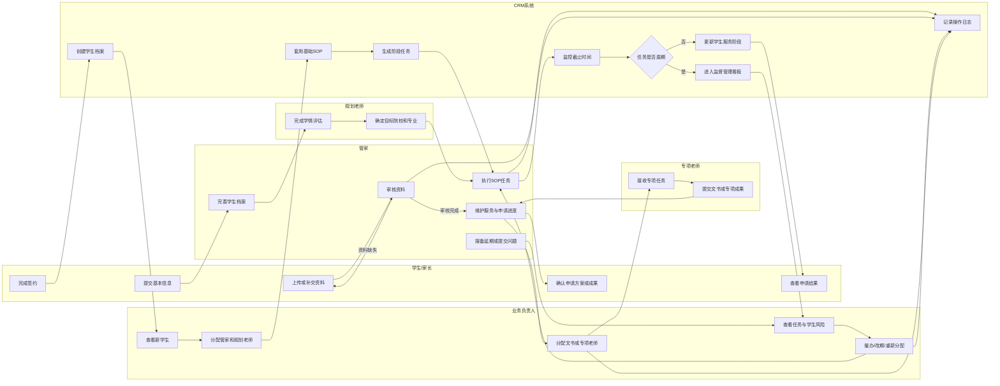
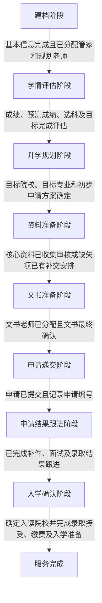
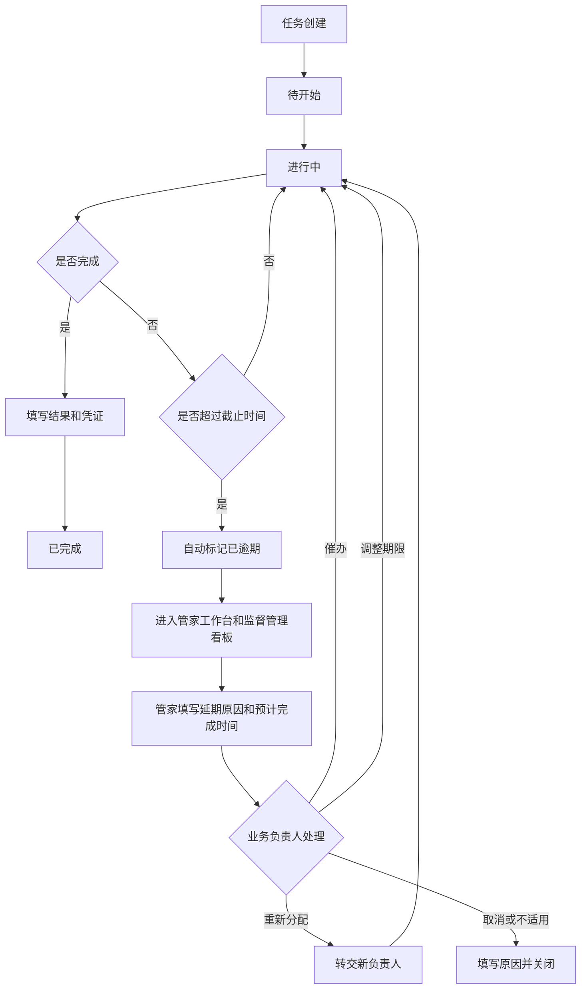

# DSE升学服务CRM 产品需求文档（PRD）

> **Status:** Approved Baseline  
> **Version:** Product PRD V1.0  
> **Baseline Date:** 2026-07-28  
> **Source:** PRD开发文档.docx（原文件保持不变）

## 基线解释与命名规则

- 系统页面统一使用“管理员端”“监督管理端”和“监督管理看板”。
- `ERIC_MANAGER` 是业务负责人角色代码，不作为整套页面或系统端名称。
- 本文描述最终产品边界；阶段交付范围与首版临时规则以对应增量PRD为准。
- 阶段1延期报备提交后立即生效并进入监督管理看板，不引入审批流程。
- 阶段5首版仅提供学生账号；家长独立账号和复杂授权不在V1.0范围。
- 首版仅提供站内通知，不接入短信、微信或企业微信。
- 资料和申请阻塞规则分别在阶段3和阶段4接入阶段计算。

## 1. 文档概述（Document Overview）

### 1.1 项目背景

DSE升学服务目前主要依赖微信群、飞书文件夹及人工表格完成学生服务、资料催收、申请进度维护和团队协作。

现有工作方式能够支持基础业务运行，但随着学生数量、申请任务和协作人员增加，逐渐出现以下问题：

管家工作缺少统一监督

管家任务分散在群聊、表格和个人记录中，缺少统一的任务负责人、截止时间、执行状态和完成结果。业务负责人难以及时发现任务拖欠，也缺少清晰的责任追踪依据。

学生服务进度不透明

管理者无法快速确认学生当前处于哪个服务阶段、已完成哪些工作、下一步需要做什么，以及是否存在影响申请的阻塞事项。

核心资料缺失难以及时发现

学生资料分散存放，资料是否完整、由谁催收、何时补交和最近一次跟进情况主要依赖管家手动统计。

管家工作流程不统一

不同管家可能采用不同的清单、服务节奏和记录方式，导致服务质量依赖个人经验，交接、复盘和监督成本较高。

人员和专项任务分配关系不清晰

学生与管家、规划老师，以及文书任务与文书老师之间的分配关系缺乏统一记录，人员调整和任务交接难以追溯。

因此，本项目拟建设一套以任务落实和学生服务过程监督为核心的DSE升学服务CRM，将管家工作、学生服务阶段、资料状态、申请进度及人员关系统一纳入系统管理。

### 1.2 产品目标

#### 1.2.1 核心目标

将管家日常工作转化为可分配、可记录、可追踪、可预警和可追责的系统任务。

让业务负责人能够通过统一看板掌握全部管家的任务执行情况和学生服务风险。

将学生从签约到入学的服务过程标准化为统一阶段，并明确每个阶段的进入和完成条件。

集中展示学生成绩、目标院校、核心资料缺失、申请状态、当前负责人和下一服务节点。

建立管家、规划老师、文书老师及专项老师的统一分配和变更留痕机制。

#### 1.2.2 建议业务指标

| 指标                 | 目标值 | 说明                                         |
| -------------------- | ------ | -------------------------------------------- |
| P0任务系统记录率     | 100%   | 所有首版关键工作均通过任务记录               |
| 逾期任务看板暴露率   | 100%   | 超过截止时间未完成的任务必须进入监督管理看板 |
| 任务责任人明确率     | 100%   | 每项任务必须存在唯一主要负责人               |
| 学生当前阶段可识别率 | 100%   | 每名在服学生均显示当前服务阶段               |
| 核心缺失资料可追踪率 | 100%   | 缺失资料必须包含负责人及补交时间             |
| 管家变更留痕率       | 100%   | 原管家、新管家、变更原因及任务交接均保留     |
| 关键操作审计覆盖率   | 100%   | 任务、资料、申请和人员分配的关键变更均记录   |

以上数值作为产品验收基线，不代表员工绩效评价标准。

### 1.3 适用范围

#### 1.3.1 V1.0范围

V1.0主要建设以下能力：

- 监督管理看板
- 管家任务管理
- 管家任务逾期和异常暴露
- 学生档案和服务进度管理
- 八阶段基础服务SOP
- 学生核心资料上传、审核、缺失标记和催收
- 香港院校及JUPAS申请进度记录
- 管家、规划老师和专项老师分配
- 文书及其他专项任务管理
- 站内消息、工作台待办和操作日志
  学生/家长基础资料提交与进度查看入口。

#### 1.3.2 V1.0不包含

- 销售线索、合同、付款和财务结算
- 内地高考及其他国家申请的完整业务流程
- 微信聊天内容自动同步
- CRM内部即时聊天
- AI自动选校、AI文书生成和成功概率预测
- 自动员工绩效评分
- 复杂的多级审批
- 文书、面试、背景提升团队的独立复杂子系统
- CRM与飞书的自动接口同步
  复杂的流程设计器和可视化拖拽编排。

#### 1.3.3 后续迭代方向

| 版本 | 主要方向                                                 |
| ---- | -------------------------------------------------------- |
| V1.1 | 批量任务操作、任务升级策略、飞书自动归档、管家工作量报表 |
| V1.2 | 规划老师独立工作台、专项任务协作增强、更多通知渠道       |
| V2.0 | 多地区申请、家长独立账号、企业微信或微信能力             |
| 远期 | 风险预测、自动进度总结、智能选校和经营分析驾驶舱         |

### 1.4 术语定义

| 术语       | 定义                                                                   |
| ---------- | ---------------------------------------------------------------------- |
| DSE        | 香港中学文凭考试，Hong Kong Diploma of Secondary Education Examination |
| JUPAS      | 大学联合招生办法，供符合资格的DSE考生申请参与院校课程                  |
| CRM        | 统一管理学生、团队关系、任务、资料、申请和服务进度的业务系统           |
| 业务负责人 | 项目负责人角色，负责全局监督、异常介入和人员分配                       |
| 管家       | 负责学生日常协调、资料催收、服务进度维护和问题转达的主要执行角色       |
| 规划老师   | 负责学生学情评估、升学方向、院校及专业规划的业务角色                   |
| 专项老师   | 执行文书、面试、背景提升等专项任务的人员                               |
| 管家任务   | 系统中承载管家具体工作的基本记录单元                                   |
| SOP        | 将学生服务拆分为阶段、标准任务和完成条件的基础工作流程                 |
| 服务阶段   | 学生从签约到入学过程中的业务阶段                                       |
| 当前负责人 | 当前对学生或任务承担主要责任的人员                                     |
| 软删除     | 不物理删除数据，而是标记为作废、取消或停用                             |
| 核心资料   | 会直接影响学情评估、文书准备或申请递交的关键材料                       |
| 临期任务   | 接近截止时间但尚未完成的任务，具体阈值暂不固定                         |
| 逾期任务   | 当前时间超过截止时间且状态未完成、取消或不适用的任务                   |

## 2. 用户角色与画像（User Personas）

### 2.1 业务负责人

角色定位： 项目负责人和业务管理者。

核心诉求：

- 掌握每名管家的任务数量、完成情况和逾期情况
- 及时发现长期未更新或存在风险的学生
- 查看学生成绩、目标院校、资料缺失和申请进度
- 分配管家、规划老师和专项老师
- 对逾期任务进行催办、改期、重新分配或关闭异常
  追溯任务拖欠和人员变更过程。

主要使用场景：

- 每日查看工作看板
- 检查逾期和异常任务
- 查看重点学生服务进度
- 分配新学生服务团队
- 为文书等任务分配专项老师
  对管家报备的延期事项进行处理。

主要痛点：

- 任务执行情况依赖人工汇报
- 无法快速判断问题由谁负责
- 学生风险发现较晚
  人员负载和分配关系不透明。

### 2.2 管家

角色定位： 学生服务流程的主要执行者和协调者。

核心诉求：

- 清楚知道本人今天、近期和已经逾期的任务
- 按统一SOP执行学生服务
- 快速查看学生资料缺失和下一节点
- 记录任务进度、结果、延期原因和催收情况
  向业务负责人反馈需要专业判断或资源支持的问题。

主要使用场景：

- 每日查看个人工作台
- 开始、更新和完成任务
- 审核学生资料
- 创建或关联资料催收任务
- 更新学生服务阶段和申请状态
  提交问题或专项服务需求。

主要痛点：

- 工作事项分散
- 容易漏催资料或漏更新申请
- 不清楚统一的完成标准
  更换学生负责人时交接困难。

### 2.3 学生/家长

角色定位： 服务对象和资料提供者。

核心诉求：

- 知道当前需要提交什么资料
- 知道资料为何被退回或还缺什么
- 查看当前服务进度和下一步安排
- 查看申请院校及申请状态
  完成必要的资料或方案确认。

主要使用场景：

- 上传或补交资料
- 查看资料审核状态
- 查看当前服务阶段
  查看香港申请及JUPAS申请进度。

主要痛点：

- 不清楚应提交的材料和截止时间
- 不清楚服务已经进行到哪一步
  申请进度依赖群内询问。

说明： 学生与家长的账号关系、家长是否拥有独立账号暂标记为 [需确认]。

### 2.4 规划老师

角色定位： 负责学生长期规划和申请方向判断。

核心诉求：

- 查看学生成绩、选科和升学目标
- 记录目标院校、目标专业和规划结论
- 了解学生资料和当前服务阶段
  与业务负责人和管家保持规划信息一致。

### 2.5 专项老师

角色定位： 接收并执行文书、面试或背景提升等具体任务。

核心诉求：

- 查看被分配任务的要求、学生背景和截止时间
- 获取完成任务所需的资料
- 更新任务进度并提交成果
  避免访问与任务无关的学生信息。

业务约束：

- 文书老师分配到具体文书任务，不永久绑定整名学生
- 除背景提升团队任务外，其他任务默认仅允许一名主要负责人
  背景提升团队多人协作方式标记为 [需确认]。

### 2.6 管理员

角色定位： 系统账号、权限和基础配置维护人员。

核心诉求：

- 创建、停用和维护人员账号
- 分配角色和数据权限
- 维护基础资料类型
- 查看安全日志和操作日志
  对误操作数据进行受控恢复。

## 3. 业务流程图（Business Process Flow）

### 3.1 核心服务流程泳道图

### 3.2 学生服务阶段流程

### 3.3 管家任务逾期处理流程

## 4. 功能需求详情（Functional Requirements）

### 4.1 账号登录与权限管理

#### 功能描述

为业务负责人、管家、规划老师、专项老师、管理员及学生/家长提供身份认证，并基于角色、学生关系和任务关系控制菜单、数据和操作权限。

#### 用户故事

作为管理员，我希望为员工创建账号并分配角色，以便控制系统访问范围。

作为管家，我希望只能查看本人负责的学生，以保护其他学生隐私。

作为专项老师，我希望只看到完成任务所需的信息，以避免接触无关数据。

作为业务负责人，我希望查看全部在服学生和管家任务，以便进行全局监督。

#### 前置条件

- 用户账号已创建且处于启用状态
- 用户已被分配至少一个有效角色
  涉及学生或任务的数据访问时，系统已建立相应关系。

#### 页面/交互逻辑

登录页：

- 产品名称及Logo
- 账号输入框
- 密码输入框
- 登录按钮
- 忘记密码入口 [需确认]
- 登录失败提示
  密码连续错误锁定提示。

人员账号页：

- 列表字段：姓名、账号、角色、所属团队、状态、最后登录时间
- 支持按姓名、角色和状态筛选
- 支持新建账号、编辑角色、启用、停用
- 停用账号前提示其负责学生及未完成任务数量
  停用操作需二次确认。

#### 权限原则

- 菜单级权限控制
- 页面级权限控制
- 数据级权限控制
- 操作级权限控制
  高敏感字段默认脱敏。

#### 后端逻辑/数据处理

核心数据表建议：

- users

  | 字段          | 类型         | 说明                     |
  | ------------- | ------------ | ------------------------ |
  | id            | bigint       | 用户ID                   |
  | username      | varchar(64)  | 登录账号，唯一           |
  | password_hash | varchar(255) | 加密密码                 |
  | display_name  | varchar(100) | 姓名                     |
  | status        | enum         | active、disabled、locked |
  | last_login_at | datetime     | 最后登录时间             |
  | created_at    | datetime     | 创建时间                 |
  | updated_at    | datetime     | 更新时间                 |

- roles
- id
- role_code
- role_name
- description
- user_roles
- user_id
- role_id
- effective_at
- expired_at

#### 接口建议

POST /api/auth/login

POST /api/auth/logout

GET /api/auth/me

GET /api/admin/users

POST /api/admin/users

PATCH /api/admin/users/{id}

POST /api/admin/users/{id}/disable

#### 校验规则

- 登录账号唯一
- 密码不得明文存储
- 停用用户不得登录
- 越权访问统一返回403
  不向未授权用户暴露目标数据是否存在。

#### 异常流程

- 账号不存在或密码错误：统一提示“账号或密码错误”
- 账号停用：提示联系管理员
- 登录状态过期：跳转登录页并保留原访问地址
- 权限不足：展示无权限页面，不显示敏感数据
  用户停用但仍有任务：提示管理员先完成任务交接。

### 4.2 监督管理看板

#### 功能描述

集中展示全部管家的任务执行情况、逾期异常、学生服务进度和重点风险，是业务负责人进行监督和介入的默认首页。

#### 用户故事

作为业务负责人，我希望在一个页面看到全部管家的任务和学生风险，以便快速发现拖欠工作并进行介入。

#### 前置条件

- 业务负责人账号已登录
- 系统中已存在学生和任务数据
  业务负责人拥有全局业务查看权限。

#### 页面/交互逻辑

页面采用“顶部指标卡＋任务监督区＋学生风险区”的桌面布局。

顶部指标卡：

- 今日待办任务数
- 临期任务数
- 逾期任务数
- 连续未更新任务数
- 风险学生数
  待分配任务数。

具体临期和连续未更新阈值暂不定义，页面需预留配置能力。

管家任务追踪区：

字段建议：

- 管家姓名
- 当前负责学生数
- 任务总数
- 已完成任务数
- 进行中任务数
- 逾期任务数
- 最早逾期日期
  最后更新时间。

支持：

- 按管家筛选
- 按学生筛选
- 按服务阶段筛选
- 按任务状态筛选
- 按截止日期筛选
- 点击数字进入任务列表
  点击管家进入该管家工作明细。

逾期与异常任务区：

字段建议：

- 任务名称
- 学生
- 负责人
- 服务阶段
- 原截止时间
- 当前截止时间
- 逾期天数
- 延期原因
- 预计完成时间
  最后更新时间。

操作：

- 查看详情
- 催办
- 修改截止时间
- 重新分配
- 标记取消或不适用
  查看任务时间线。

学生服务风险区：

展示：

- 学生姓名
- 当前阶段
- 核心资料缺失数
- 逾期任务数
- 最近进度更新时间
- 下一节点
- 风险说明
  当前管家。

点击学生进入学生详情。

#### 后端逻辑/数据处理

看板数据由任务、学生服务进度、资料状态和人员分配关系实时汇总。

#### 接口建议

GET /api/dashboard/supervision/summary

GET /api/dashboard/supervision/butler-performance

GET /api/dashboard/supervision/overdue-tasks

GET /api/dashboard/supervision/student-risks

查询参数：

- butler_id
- student_id
- stage_code
- task_status
- deadline_from
- deadline_to
- risk_level
- page
- page_size

#### 计算规则

- 逾期任务：当前时间大于当前截止时间，且任务不处于已完成、已取消或不适用状态
- 完成率仅用于展示，不定义绩效用途
- 逾期天数按自然日计算 [假设]
  看板统计应与任务列表使用相同数据口径。

#### 异常流程

- 无任务数据：展示空状态及“当前没有符合条件的任务”
- 统计接口失败：指标卡显示加载失败，并支持刷新
- 部分模块失败：其他模块正常展示，不阻塞整个看板
- 数据更新时间过旧：显示最近成功刷新时间
  用户无业务负责人权限：拒绝访问。

### 4.3 管家任务管理

#### 功能描述

将管家工作转化为标准任务，支持任务生成、分配、执行、进度记录、完成、延期报备、逾期识别、重新分配和全过程追踪。

#### 用户故事

作为管家，我希望看到本人所有任务和截止时间，以便安排每天的工作。

作为管家，我希望记录任务进度和完成结果，以便证明任务已经落实。

作为业务负责人，我希望看到逾期任务并介入处理，以降低学生服务延误风险。

#### 前置条件

- 任务已由SOP、业务负责人或管家创建
- 任务已关联学生
  任务已分配负责人，未分配任务除外。

#### 页面/交互逻辑

管家工作台：

分区展示：

- 今日任务
- 近期任务
- 已逾期任务
- 待审核资料
- 待更新申请
  待反馈业务负责人事项。

任务列表字段：

- 任务名称
- 学生
- 所属阶段
- 任务来源
- 完成标准
- 优先级占位字段
- 当前截止时间
- 状态
- 是否逾期
  最后更新时间。

任务优先级首版不定义具体枚举，但数据表和页面预留字段。

任务操作：

- 开始任务
- 更新进度
- 标记完成
- 申请延期
- 标记不适用
  查看详情。

任务详情页：

- 基本信息
- 关联学生
- 负责人和协作人
- 任务来源
- 完成标准
- 原截止时间
- 当前截止时间
- 进度说明
- 结果说明
- 附件或凭证
- 延期原因
- 预计完成时间
- 业务负责人介入记录
  操作时间线。

完成交互：

- 点击“完成任务”
- 系统检查必填结果
- 如任务要求凭证，则检查附件
- 校验通过后更新为已完成
- 更新完成人和完成时间
  必要时触发服务阶段重新计算。

延期交互：

- 管家点击“申请延期”
- 填写延期原因
- 填写预计完成时间
- 提交后向业务负责人报备
- 首版是否需要业务负责人审批标记为 [需确认]
  无论是否审批，必须保留原截止时间。

#### 后端逻辑/数据处理

- tasks

  | 字段                | 类型         | 说明                                        |
  | ------------------- | ------------ | ------------------------------------------- |
  | id                  | bigint       | 任务ID                                      |
  | title               | varchar(200) | 任务名称                                    |
  | student_id          | bigint       | 关联学生                                    |
  | stage_id            | bigint       | 所属服务阶段                                |
  | source_type         | enum         | sop、manager、butler、application、material |
  | source_id           | bigint       | 来源对象ID                                  |
  | owner_id            | bigint       | 主要负责人                                  |
  | collaborator_ids    | json         | 协作人，仅预留                              |
  | original_due_at     | datetime     | 原截止时间                                  |
  | current_due_at      | datetime     | 当前截止时间                                |
  | status              | varchar(32)  | 状态通道，具体枚举暂不最终锁定              |
  | priority            | varchar(32)  | 优先级预留                                  |
  | completion_criteria | text         | 完成标准                                    |
  | progress_note       | text         | 进度说明                                    |
  | result_note         | text         | 完成结果                                    |
  | completed_at        | datetime     | 完成时间                                    |
  | extension_reason    | text         | 延期原因                                    |
  | expected_finish_at  | datetime     | 预计完成时间                                |
  | last_updated_at     | datetime     | 最后更新时间                                |
  | created_by          | bigint       | 创建人                                      |
  | created_at          | datetime     | 创建时间                                    |

- task_status_logs
- task_id
- from_status
- to_status
- operator_id
- reason
- created_at
- task_due_date_logs
- task_id
- old_due_at
- new_due_at
- change_reason
- operator_id
- created_at

#### 接口建议

GET /api/tasks

POST /api/tasks

GET /api/tasks/{id}

PATCH /api/tasks/{id}

POST /api/tasks/{id}/start

POST /api/tasks/{id}/progress

POST /api/tasks/{id}/complete

POST /api/tasks/{id}/extend

POST /api/tasks/{id}/reassign

POST /api/tasks/{id}/cancel

POST /api/tasks/{id}/reopen

#### 业务规则

- 每项P0任务必须关联学生
- 每项任务必须存在来源、负责人、截止时间和完成标准
- 超过截止时间未完成时自动标记为逾期
- 管家延期必须填写原因和预计完成时间
- 修改截止时间不得覆盖原始截止时间
- 任务完成必须记录结果
- 关键任务可要求上传凭证
- 普通用户不得物理删除任务
  任务重新分配时保留原负责人和变更原因。

#### 异常流程

- 任务无负责人：进入待分配状态
- 完成条件未满足：阻止完成并定位缺失字段
- 逾期后未填写原因：持续显示待报备标识
- 重复提交完成请求：接口保持幂等
- 任务已取消：禁止再次更新进度，除非重新打开
- 原负责人已停用：任务进入待重新分配
  网络中断：保留表单内容并提示重试。

### 4.4 学生档案与服务进度管理

#### 功能描述

统一保存学生基础信息、成绩、目标院校、服务团队、当前服务阶段、资料状态、申请进度和风险信息。

#### 用户故事

作为业务负责人，我希望查看学生的完整业务概览，以便判断服务风险。

作为管家，我希望看到学生当前阶段和下一步，以便执行正确任务。

作为规划老师，我希望查看成绩和目标院校，以便完成规划判断。

#### 前置条件

- 学生已完成签约
- 学生档案已在CRM创建
  已分配管家和规划老师，或处于待分配状态。

#### 页面/交互逻辑

学生列表页：

字段：

- 姓名
- 学校
- 年级
- 届别
- 当前阶段
- 当前管家
- 规划老师
- 目标院校
- 核心资料缺失数
- 逾期任务数
- 风险状态
  最后更新时间。

支持：

- 姓名搜索
- 学校、年级、届别筛选
- 管家筛选
- 阶段筛选
- 风险筛选
- 资料缺失筛选
  分页和排序。

学生详情页：

页面建议采用顶部概览＋标签页结构。

顶部概览：

- 姓名
- 学校、年级和届别
- 当前服务阶段
- 下一节点
- 当前管家
- 规划老师
- 资料完整情况
- 申请进度
  风险状态。

标签页：

- 基本信息
- 学情与成绩
- 升学目标
- 服务进度
- 资料
- 申请记录
- 服务团队
- 任务
  操作记录。

服务进度页：

以八阶段纵向时间线展示：

- 阶段名称
- 阶段状态
- 进入时间
- 阶段任务总数
- 已完成任务数
- 未完成关键任务
- 阻塞资料
- 完成条件
  下一阶段。

不得仅使用单一百分比代替具体任务和缺失事项。

#### 后端逻辑/数据处理

- students
- id
- chinese_name
- english_name
- school
- grade
- cohort_year
- service_status
- current_stage_id
- next_milestone
- risk_level
- risk_note
- created_at
- updated_at
- student_scores
- student_id
- subject_name
- score_type：current、predicted
- score_value
- updated_by
- updated_at
- student_targets
- student_id
- institution_name
- program_name
- target_level
- status
- updated_by
- updated_at
- student_service_progress
- student_id
- current_stage_id
- stage_started_at
- total_task_count
- completed_task_count
- missing_material_count
- next_milestone
- last_calculated_at

#### 接口建议

GET /api/students

POST /api/students

GET /api/students/{id}

PATCH /api/students/{id}

GET /api/students/{id}/progress

GET /api/students/{id}/summary

PATCH /api/students/{id}/risk

阶段更新逻辑：

- 系统根据当前阶段的基础完成条件计算是否满足推进条件
- 管家负责更新事实状态
- 核心任务未完成时原则上不得进入下一阶段
- 对资料准备阶段，暂时缺失的资料如已填写缺失原因、负责人和补交时间，可由有权限人员继续推进
- 越级推进必须填写原因并记录操作日志
  是否需要业务负责人审批暂标记为 [需确认]。

#### 异常流程

- 学生未分配管家：显示待分配风险
- 阶段完成条件不满足：展示具体阻塞项
- 成绩数据为空：展示“尚未录入”，不得按0分处理
- 学生暂停服务：冻结自动生成新任务，保留历史
- 学生终止服务：关闭未完成任务前要求填写处理方式
  重复学生档案：根据姓名、学校、届别提示可能重复，禁止静默创建。

### 4.5 基础SOP与服务阶段管理

#### 功能描述

建立首版固定的八阶段服务流程，并为每个阶段配置最基础的标准任务、负责人类型和完成条件。

首版不建设复杂的流程设计器，仅实现基础SOP配置和任务生成。

#### 用户故事

作为业务负责人，我希望新学生自动获得统一的基础任务，以便不同管家按照相同流程服务。

作为管家，我希望看到当前阶段应完成的标准工作，以便减少遗漏。

作为管理员，我希望可以启用或停用SOP版本，以便维护业务基线。

#### 前置条件

- 已配置启用状态的基础SOP
- 学生已完成建档
  学生已分配服务团队。

#### 页面/交互逻辑

SOP列表页：

- 流程名称
- 版本号
- 适用服务类型
- 阶段数量
- 任务数量
- 状态
- 生效时间
  最后修改人。

操作：

- 查看
- 复制
- 编辑基础信息
- 启用
  停用。

SOP详情页：

按顺序展示八个阶段：

- 建档阶段
- 学情评估阶段
- 升学规划阶段
- 资料准备阶段
- 文书准备阶段
- 申请递交阶段
- 申请结果跟进阶段
  入学确认阶段。

每个阶段展示：

- 阶段名称
- 进入条件
- 完成条件
- 标准任务
- 默认负责人类型
- 默认截止规则占位
- 是否必经
  是否允许不适用。

模板更新规则：

- 模板修改不自动覆盖已执行任务
- 可选择同步到尚未开始的任务 [需确认]
- 已完成任务不得被模板更新修改
  停用模板不删除已生成任务。

#### 后端逻辑/数据处理

- service_workflows
- id
- name
- version
- service_type
- status
- effective_at
- created_by
- workflow_stages
- id
- workflow_id
- stage_code
- stage_name
- sequence_no
- entry_condition
- completion_condition
- is_required
- workflow_task_templates
- id
- stage_id
- task_name
- owner_role
- default_due_rule
- completion_criteria
- evidence_required
- allow_skip
- student_stage_instances
- student_id
- workflow_stage_id
- status
- started_at
- completed_at
- override_reason

#### 接口建议

GET /api/workflows

POST /api/workflows

GET /api/workflows/{id}

PATCH /api/workflows/{id}

POST /api/workflows/{id}/activate

POST /api/students/{id}/apply-workflow

八阶段基础条件：

| 阶段             | 进入条件           | 完成条件                                                     |
| ---------------- | ------------------ | ------------------------------------------------------------ |
| 建档阶段         | 学生签约后         | 完成基本信息录入，并分配管家和规划老师                       |
| 学情评估阶段     | 建档完成           | 完成当前成绩、预测成绩、选科和升学目标评估                   |
| 升学规划阶段     | 学情评估完成       | 确定目标院校、目标专业和初步申请方案                         |
| 资料准备阶段     | 申请方向确定       | 核心申请资料完成收集和审核；缺失项已有原因、负责人和补交时间 |
| 文书准备阶段     | 选校和专业基本确定 | 完成文书老师分配、撰写、修改和最终确认                       |
| 申请递交阶段     | 申请材料准备完成   | 完成申请提交，记录院校、专业、时间和申请编号                 |
| 申请结果跟进阶段 | 申请递交完成       | 完成补件、面试、录取或拒绝等结果跟进                         |
| 入学确认阶段     | 收到录取结果       | 确定入读院校并完成接受录取、缴费和必要准备                   |

#### 异常流程

- 无启用SOP：学生建档成功，但标记为未套用流程
- 生成任务失败：记录失败原因，支持重新生成
- 重复套用：阻止创建重复阶段和任务
- 模板被停用：已套用学生不受影响
  模板阶段顺序错误：启用前进行完整性校验。

### 4.6 资料管理与缺失催收

#### 功能描述

支持学生上传资料、管家审核、缺失标记、补交、版本保留和催收任务关联。

#### 用户故事

作为学生，我希望上传和补交资料，以便完成申请准备。

作为管家，我希望标记资料缺失并创建催收任务，以便及时补齐材料。

作为业务负责人，我希望查看每名学生的核心资料缺失情况，以便识别风险。

#### 前置条件

- 学生已建档
- 系统已配置基础资料清单
  学生或管家拥有上传权限。

#### 页面/交互逻辑

学生端资料清单：

- 资料名称
- 要求说明
- 截止日期
- 当前状态
- 缺失说明
- 最近上传时间
  上传或补交按钮。

管家资料审核页：

- 学生信息
- 资料分类
- 文件预览
- 当前版本
- 历史版本
- 上传人
- 上传时间
- 审核结论
- 审核意见
- 缺失项
  补交截止时间。

审核结果：

- 通过
- 部分缺失
- 需补交
- 待学生确认
  不适用。

缺失资料处理：

- 管家标记缺失
- 填写缺失原因
- 指定责任人
- 设置补交时间
- 创建或关联催收任务
  记录最近催收结果。

版本规则：

- 每次上传形成新版本
- 新文件不得覆盖旧版本
- 当前有效版本单独标记
- 历史版本按权限查看
  飞书人工归档后记录归档状态和时间。

#### 后端逻辑/数据处理

- material_items
- id
- student_id
- material_type_id
- title
- requirement
- due_at
- owner_id
- status
- missing_reason
- expected_submit_at
- current_version_id
- archive_status
- archived_at
- material_versions
- id
- material_item_id
- version_no
- file_name
- mime_type
- file_size
- storage_key
- uploaded_by
- uploaded_at
- review_status
- reviewed_by
- reviewed_at
- review_comment
- material_followups
- material_item_id
- task_id
- followup_note
- followed_by
- followed_at

#### 校验规则

- 支持PDF、DOC、DOCX、JPG、JPEG、PNG
- 单文件建议不超过50MB
- 不支持格式应在上传前提示
- 文件上传成功后才创建版本记录
- 同一资料允许多版本
- 缺失状态必须填写缺失说明
  已设置补交计划时必须填写负责人和补交时间。

#### 接口建议

GET /api/students/{id}/materials

POST /api/materials/{id}/versions

POST /api/materials/{id}/review

POST /api/materials/{id}/mark-missing

POST /api/materials/{id}/create-followup-task

POST /api/materials/{id}/archive-manually

#### 异常流程

- 上传失败：不创建版本记录
- 文件过大或格式不符：明确提示限制
- 文件内容重复：提示可能重复，但允许作为新版本提交
- 预览失败：允许下载原文件
- 病毒或安全扫描失败：文件隔离，不进入审核
- 人工飞书归档失败：CRM资料状态不回滚，记录失败原因
  无权限下载：返回403并记录日志。

### 4.7 人员分配与任务交接

#### 功能描述

支持业务负责人为学生分配或更换管家、规划老师，并为具体文书或专项任务分配老师。

#### 用户故事

作为业务负责人，我希望为新学生分配管家和规划老师，以便启动服务。

作为业务负责人，我希望更换管家时自动转交未完成任务，以避免工作遗漏。

作为业务负责人，我希望将文书老师分配到具体任务，以便明确交付责任。

#### 前置条件

- 学生档案已存在
- 候选人员账号已启用
  候选人员具备相应角色。

#### 页面/交互逻辑

学生负责人分配页：

字段：

- 学生
- 当前管家
- 当前规划老师
- 候选人员
- 当前负责学生数
- 未完成任务数
  最近分配时间。

操作：

- 分配管家
- 更换管家
- 分配规划老师
- 更换规划老师
  查看历史。

更换管家交互：

- 选择新管家
- 展示原管家的未完成任务
- 默认勾选全部转交
- 填写变更原因
- 确认交接
- 系统更新当前管家
- 未完成任务默认转给新管家
- 通知原管家、新管家和业务负责人
  保留分配历史。

专项老师分配页：

- 任务名称
- 学生
- 专项类型
- 当前负责人
- 候选老师
- 截止时间
- 所需资料
  分配说明。

文书老师必须分配到具体文书任务。

#### 后端逻辑/数据处理

- student_staff_assignments
- id
- student_id
- assignment_type：butler、planner
- staff_id
- effective_at
- ended_at
- assigned_by
- previous_staff_id
- change_reason
- is_current
- task_assignments
- id
- task_id
- staff_id
- assignment_role
- assigned_by
- assigned_at
- ended_at
- change_reason
- is_current

#### 接口建议

POST /api/students/{id}/assign-butler

POST /api/students/{id}/assign-planner

POST /api/students/{id}/change-butler

POST /api/tasks/{id}/assign-specialist

GET /api/students/{id}/assignment-history

#### 业务规则

- 一名学生同一时间只能有一名当前管家
- 一名学生同一时间只能有一名当前规划老师
- 业务负责人直接分配规划老师
- 更换管家时，未完成任务默认转给新管家
- 已完成任务不更换负责人
- 文书老师与具体文书任务绑定
  非背景提升任务默认只允许一名主要负责人。

#### 异常流程

- 候选人员已停用：禁止分配
- 更换为同一人员：不执行变更
- 未填写变更原因：禁止提交
- 任务存在进行中成果：提示确认是否转交
- 部分任务转交失败：人员关系不切换，事务整体回滚
  背景提升多人协作：首版仅预留协作人字段，具体规则 [需确认]。

### 4.8 香港申请与JUPAS申请管理

#### 功能描述

以“学生＋申请渠道＋院校＋专业或志愿项”为最小记录单位，维护申请准备、递交、补件、面试和结果。

#### 用户故事

作为管家，我希望记录每项申请的状态，以便持续跟进。

作为学生，我希望查看申请已经进行到哪一步。

作为业务负责人，我希望查看学生是否存在临近截止或长期未更新的申请。

#### 前置条件

- 学生已完成升学规划
- 已明确申请渠道、院校和专业或JUPAS志愿
  管家拥有该学生权限。

#### 页面/交互逻辑

申请列表页：

字段：

- 学生
- 渠道
- 院校
- 专业或志愿项
- 轮次
- 截止日期
- 当前状态
- 提交时间
- 申请编号
- 补件状态
- 面试状态
- 申请结果
- 负责人
  最后更新时间。

申请详情页：

- 基本申请信息
- 关联资料
- 关联任务
- 状态时间线
- 补件记录
- 面试记录
- Offer条件
- 确认截止时间
  入读决定。

状态变化：

建议保留以下基础通道：

- 待规划
- 已确定
- 资料准备
- 待提交
- 已提交
- 等待结果
- 补件
- 面试
- Offer
- 未录取
- 确认入读
  已放弃。

最终状态枚举在开发前由业务确认。

#### 任务联动

- 新增补件要求可创建补件任务
- 进入面试阶段可创建面试准备任务
- 获得Offer后可创建确认录取和缴费任务
  文书需求可创建文书专项任务。

#### 后端逻辑/数据处理

- applications
- id
- student_id
- channel
- institution_name
- program_name
- preference_no
- round_name
- deadline_at
- status
- submitted_at
- application_no
- result
- offer_condition
- confirmation_deadline
- owner_id
- last_updated_at
- application_status_logs
- application_id
- from_status
- to_status
- operator_id
- note
- changed_at
- application_requirements
- application_id
- requirement_type
- description
- due_at
- linked_task_id
- status

#### 接口建议

GET /api/applications

POST /api/applications

GET /api/applications/{id}

PATCH /api/applications/{id}

POST /api/applications/{id}/change-status

POST /api/applications/{id}/create-requirement-task

#### 业务规则

- 提交申请时，申请编号如已获得则必须填写
- 状态更新必须记录操作人和时间
- 院校或专业变更不得覆盖旧申请记录
- JUPAS志愿调整需保留历史版本
  外部官方系统为最终结果来源，CRM保存业务跟进记录。

#### 异常流程

- 申请记录重复：按学生、渠道、院校和专业提示
- 截止时间早于当前时间：要求二次确认
- 申请已提交后修改院校或专业：创建变更记录
- 外部系统状态不一致：允许人工修正并填写原因
  申请资料缺失：显示阻塞项并关联资料任务。

### 4.9 问题反馈与专项任务

#### 功能描述

支持管家将需要业务负责人专业判断的问题提交到系统，并由业务负责人回复、分配专项老师或转化为具体任务。

#### 用户故事

作为管家，我希望将复杂问题连同学生背景提交给业务负责人，以避免遗漏上下文。

作为业务负责人，我希望将文书或专项需求转化为任务并分配人员，以便跟踪交付。

作为专项老师，我希望收到明确的任务要求和所需资料。

#### 前置条件

- 管家已关联学生
- 问题或专项需求具备基本上下文
  业务负责人拥有处理权限。

#### 页面/交互逻辑

问题提交表单：

- 学生
- 关联任务
- 问题分类
- 问题描述
- 背景信息
- 紧急程度预留字段
- 附件
  期望处理时间 [可选]。

业务负责人处理操作：

- 直接回复
- 要求补充信息
- 转化为专项任务
- 分配专项老师
- 标记已解决
  关闭问题。

问题时间线：

- 提交
- 补充
- 业务负责人回复
- 管家转达
- 学生确认
- 关闭
  重新打开。

#### 后端逻辑/数据处理

- issues
- id
- student_id
- linked_task_id
- category
- description
- context
- priority
- status
- submitted_by
- submitted_at
- manager_response
- responded_at
- closed_at
- issue_logs
- issue_id
- action
- note
- operator_id
- created_at

#### 接口建议

POST /api/issues

GET /api/issues

GET /api/issues/{id}

POST /api/issues/{id}/respond

POST /api/issues/{id}/convert-to-task

POST /api/issues/{id}/close

POST /api/issues/{id}/reopen

#### 异常流程

- 问题上下文为空：禁止提交
- 业务负责人要求补充：状态转为待补充
- 专项老师无法访问所需资料：提示业务负责人调整授权
- 专项任务负责人停用：进入待重新分配
  问题关闭后仍未解决：允许重新打开并填写原因。

### 4.10 学生/家长端

#### 功能描述

为学生和家长提供最小可用的资料提交、待办处理、服务进度和申请进度查看入口。

#### 用户故事

作为学生，我希望看到需要补交的资料，以便及时完成。

作为家长，我希望了解服务进度，以减少反复询问。

作为学生，我希望查看申请状态，但不看到内部追责信息。

#### 前置条件

- 学生档案已创建
- 学生账号已启用
  家长账号关系 [需确认]。

#### 页面/交互逻辑

学生端优先适配手机浏览器。

首页：

- 我的待办
- 缺失资料
- 当前服务阶段
- 下一节点
- 最新进度
  申请状态摘要。

资料中心：

- 资料清单
- 上传
- 补交
- 审核意见
  历史提交记录。

服务进度：

- 当前阶段
- 已完成阶段
- 下一服务节点
- 对外可见任务
  待确认事项。

申请进度：

- 院校
- 专业
- 渠道
- 当前状态
- 递交时间
- 补件或面试提醒
  结果。

#### 信息隔离

学生/家长不得查看：

- 管家完成率
- 内部逾期责任说明
- 业务负责人内部介入备注
- 员工绩效信息
  与本人无关的学生数据。

#### 后端逻辑/数据处理

#### 接口建议

GET /api/portal/me/summary

GET /api/portal/me/materials

POST /api/portal/me/materials/{id}/upload

GET /api/portal/me/progress

GET /api/portal/me/applications

POST /api/portal/me/confirmations/{id}

#### 数据返回规则

- 使用单独的对外DTO
- 不直接复用内部详情接口
- 所有内部备注字段在服务端过滤
- 学生只能访问本人数据
  家长访问范围根据授权学生关系确定。

#### 异常流程

- 学生账号未绑定档案：提示联系管家
- 家长无授权：拒绝访问
- 资料上传失败：保留待办状态
- 申请状态尚未更新：展示最近更新时间
  内部任务逾期：学生端仅显示对外可解释的进度，不显示责任追踪内容。

### 4.11 通知、待办与操作日志

#### 功能描述

通过站内消息和工作台待办提醒任务分配、临期、逾期、资料缺失、负责人变化和申请节点，并记录关键业务操作。

#### 用户故事

作为管家，我希望收到新任务和资料待审核提醒。

作为业务负责人，我希望收到逾期和异常事项提醒。

作为管理员，我希望追溯关键数据变更。

#### 前置条件

- 用户账号有效
- 通知事件已触发
  接收人具备相应数据权限。

#### 页面/交互逻辑

通知中心：

- 未读消息数量
- 事件类型
- 标题
- 关联学生或任务
- 触发时间
- 已读状态
  点击跳转业务详情。

首版触发事件：

| 事件         | 接收人                      |
| ------------ | --------------------------- |
| 新任务分配   | 负责人                      |
| 任务临期     | 负责人                      |
| 任务逾期     | 负责人、业务负责人          |
| 延期报备     | 业务负责人                  |
| 任务重新分配 | 原负责人、新负责人          |
| 学生上传资料 | 管家                        |
| 资料缺失     | 学生/家长、管家             |
| 服务阶段变化 | 管家、学生/家长             |
| 申请状态变化 | 学生/家长、必要时业务负责人 |
| 问题提交     | 业务负责人                  |
| 专项任务分配 | 专项老师                    |

具体提醒时间和重复频率暂不定义，但通知规则应支持后续配置。

#### 后端逻辑/数据处理

- notifications
- id
- recipient_id
- event_type
- title
- content
- object_type
- object_id
- read_at
- created_at
- audit_logs
- id
- operator_id
- operator_role
- object_type
- object_id
- action
- before_data
- after_data
- reason
- ip_address
- device_info
- created_at

#### 接口建议

GET /api/notifications

POST /api/notifications/{id}/read

POST /api/notifications/read-all

GET /api/audit-logs

#### 日志范围

- 登录和登录失败
- 权限变更
- 任务创建、状态变化、改期和重新分配
- 学生阶段变化
- 资料审核和下载
- 申请状态变化
- 管家和规划老师变更
- 高敏感字段查看
  数据导出。

#### 异常流程

- 通知发送失败：不回滚业务操作
- 接收人已停用：记录失败并通知管理员
- 重复事件：使用事件唯一键避免重复通知
- 日志写入失败：关键写操作应进入错误队列并告警
  站内消息未读：不影响任务状态。

## 5. 非功能性需求（Non-Functional Requirements）

### 5.1 性能要求

| 项目               | 建议基线                           |
| ------------------ | ---------------------------------- |
| 账号规模           | 支持5,000个账号                    |
| 在服学生规模       | 支持2,000名在服学生                |
| 峰值并发           | 支持200名并发用户                  |
| 普通列表及详情接口 | P95响应时间不超过3秒               |
| 复杂查询及统计     | P95响应时间不超过5秒               |
| 文件上传           | 支持50MB以内文件                   |
| 分页               | 默认每页20条，支持20、50、100条    |
| 超时               | 普通接口建议30秒，文件上传单独配置 |

实际用户规模和存储需求标记为 [需确认]。

### 5.2 安全性要求

#### 5.2.1 身份认证

- 密码必须使用安全哈希算法存储
- 登录接口需要防暴力破解
- 连续失败达到阈值后临时锁定
- 高敏感操作建议启用二次验证
  Session或Token过期后必须重新认证。

#### 5.2.2 权限控制

- 采用角色权限和业务关系权限结合的模式
- 管家只能访问本人负责学生
- 规划老师只能访问本人负责学生
- 专项老师只能访问任务所需资料
- 学生/家长只能访问本人或已授权学生
- 业务负责人可查看全部业务概览
  管理员权限需遵循最小授权原则。

#### 5.2.3 数据保护

- 全站使用HTTPS
- 高敏感字段进行字段级加密
- 证件号码、账号等默认脱敏展示
- 文件下载使用短时有效受控链接
- 导出文件默认排除密码和完整证件号码
  导出操作必须留痕。

#### 5.2.4 隐私合规

系统需遵循：

- 数据最小化收集原则
- 明确数据使用目的
- 按业务需要控制访问
- 支持账号停用和数据归档
- 遵守适用的《中华人民共和国个人信息保护法》及业务所在地相关隐私要求
  如服务涉及欧盟居民，再评估GDPR适用性。

### 5.3 可用性与可靠性

- 业务时段保持稳定可用
- 计划维护需提前通知
- 数据库每日备份
- 文件采用多副本或对象存储
- 备份保留周期 [需确认]
- 关键任务生成和逾期计算需支持失败重试
- 第三方系统失败不得导致CRM核心业务数据丢失
  测试、预发布和生产环境应隔离。

### 5.4 兼容性要求

内部管理端

- Windows及macOS桌面浏览器
- 支持Chrome和Edge最近两个主版本
- 建议最小分辨率：1366×768
  主要设计分辨率：1440×900及以上。

学生/家长端

- 响应式网页
- 支持主流iOS Safari
- 支持主流Android Chrome
  建议适配宽度：375px及以上。

### 5.5 可维护性要求

- 前后端接口使用统一版本管理
- 枚举、权限和错误码统一维护
- 核心业务规则不得只写在前端
- 任务逾期和阶段计算需有独立服务
- 所有关键操作记录结构化日志
- 数据库变更需使用迁移脚本
  重要配置调整需记录修改人和时间。

### 5.6 埋点需求

| 事件名                     | 触发时机           | 主要属性                               |
| -------------------------- | ------------------ | -------------------------------------- |
| login_success              | 用户登录成功       | user_id、role、device                  |
| login_failed               | 登录失败           | account、reason                        |
| dashboard_viewed           | 业务负责人进入看板 | user_id、filter                        |
| task_created               | 创建任务           | source_type、owner_id、student_id      |
| task_started               | 开始任务           | task_id、owner_id                      |
| task_progress_updated      | 更新进度           | task_id、status                        |
| task_completed             | 完成任务           | task_id、duration、was_overdue         |
| task_overdue_detected      | 系统识别逾期       | task_id、overdue_days                  |
| task_extension_submitted   | 管家报备延期       | task_id、owner_id                      |
| task_reassigned            | 重新分配任务       | old_owner、new_owner                   |
| student_stage_changed      | 服务阶段变化       | student_id、from_stage、to_stage       |
| material_uploaded          | 上传资料           | student_id、material_type、file_size   |
| material_marked_missing    | 标记缺失           | student_id、material_type              |
| application_status_changed | 申请状态变化       | application_id、from_status、to_status |
| staff_assignment_changed   | 更换负责人         | student_id、assignment_type            |
| data_exported              | 数据导出           | operator_id、scope、record_count       |
| sensitive_data_viewed      | 查看高敏感字段     | operator_id、field_type                |

埋点数据只用于产品运营、问题分析和系统审计，不自动用于员工绩效评价。

## 6. 附录（Appendix）

### 6.1 参考竞品分析摘要

当前原始资料未包含明确竞品清单，因此本版本不输出具体竞品结论。

后续竞品调研建议重点关注：

- 教育机构CRM的学生档案结构
- 留学申请系统的申请项目粒度
- 工单系统的任务逾期和升级机制
- 项目管理工具的负责人变更和操作日志
  文件管理系统的资料版本控制和审核流程。

竞品能力只能用于交互和系统设计参考，不应直接替代DSE业务调研结论。

### 6.2 待确认事项（TODOs）

| 编号 | 待确认事项                 | 当前处理方式               | 影响模块       |
| ---- | -------------------------- | -------------------------- | -------------- |
| T-01 | 任务状态最终枚举           | 首版预留状态通道           | 任务管理、看板 |
| T-02 | 任务优先级定义             | 预留字段，不参与核心逻辑   | 任务管理       |
| T-03 | 临期提醒时间               | 预留配置能力               | 通知、看板     |
| T-04 | 逾期重复提醒频率           | 暂不固定                   | 通知           |
| T-05 | 连续未更新阈值             | 暂不固定                   | 异常识别       |
| T-06 | 延期是否需要业务负责人审批 | 管家必须报备，审批规则待定 | 任务管理       |
| T-07 | 各阶段基础任务清单         | 原型深化阶段补充           | SOP            |
| T-08 | 各任务默认截止规则         | 首版预留字段               | SOP、任务      |
| T-09 | 核心资料基线清单           | 后续由管家和规划老师确认   | 资料管理       |
| T-10 | 学生与家长账号关系         | 首版按学生账号设计         | 学生端、权限   |
| T-11 | 背景提升多人协作规则       | 预留协作人字段             | 专项任务       |
| T-12 | 真实用户量和存储规模       | 使用建议基线估算           | 架构、成本     |
| T-13 | 外部通知渠道               | 首版仅站内消息             | 通知           |
| T-14 | 备份保留周期和SLA          | 技术评审确定               | 运维           |
| T-15 | SOP模板更新同步规则        | 默认不覆盖已执行任务       | SOP            |
| T-16 | 服务阶段越级审批规则       | 要求填写原因并留痕         | 学生进度       |

### 6.3 风险预估

| 风险                   | 影响                   | 应对措施                                     |
| ---------------------- | ---------------------- | -------------------------------------------- |
| 业务规则尚未完全确定   | 返工或开发延期         | 首版采用基础流程，复杂规则配置化预留         |
| 管家未及时更新任务     | 看板数据失真           | 将任务更新纳入日常工作要求，展示最后更新时间 |
| 资料仍主要在微信群流转 | CRM资料不完整          | 明确关键业务事实必须录入CRM                  |
| SOP设计过于复杂        | 首版范围失控           | 仅实现固定八阶段和基础任务                   |
| 过早建设绩效功能       | 员工抵触且偏离核心目标 | 首版只展示事实数据，不定义绩效用途           |
| 敏感数据泄露           | 合规和声誉风险         | 最小收集、加密、脱敏、日志和权限隔离         |
| 飞书人工归档遗漏       | 正式文件备份不完整     | CRM记录归档状态，提供待归档筛选              |
| 任务改期覆盖原记录     | 无法追责               | 原截止时间和历次变更独立保存                 |
| 更换管家后任务遗漏     | 服务中断               | 未完成任务默认转交并生成交接清单             |
| 学生端暴露内部信息     | 影响客户体验和员工管理 | 使用独立对外接口及字段白名单                 |

### 6.4 V1.0上线验收总则

新学生建档后，可以分配管家和规划老师。

系统可套用基础八阶段SOP并生成标准任务。

每项P0任务均包含学生、负责人、来源、截止时间、状态和完成标准。

管家可更新进度、填写结果、提交凭证和报备延期。

任务逾期后自动进入管家工作台和监督管理看板。

业务负责人可催办、改期、重新分配或关闭异常。

原截止时间、原负责人和关键状态变化均可追溯。

学生详情可显示当前阶段、下一节点、成绩、目标院校、资料缺失和申请进度。

更换管家时，未完成任务默认转交新管家。

文书老师可被分配到具体文书任务。

学生资料支持上传、审核、缺失标记、补交和历史版本。

香港申请和JUPAS申请状态支持记录和时间线追踪。

学生/家长只能查看对外信息，无法查看内部追责内容。

所有角色均通过权限和业务关系访问数据。

关键操作、敏感访问和数据导出均记录日志。

管家任务监督闭环和学生服务进度闭环通过端到端测试。

## 文档结论

DSE升学服务CRM V1.0的核心不是建设一个功能复杂的综合教育平台，而是建立一套能够真正落实工作的服务过程管理系统。

首版必须优先证明以下四项能力：

- 管家工作能够通过基础SOP转化为明确任务
- 管家任务能够被记录、跟踪、预警和追责
- 业务负责人能够及时发现逾期任务和学生服务风险
  每名学生的服务阶段、核心资料、申请进度和责任人员能够被清晰查询。

在以上基础能力稳定后，再扩展自动同步、复杂统计、多团队协作和智能化能力。
