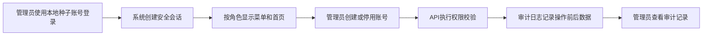

# S0 技术底座功能增量PRD

**状态：** Approved  
**目标版本：** v0.1.0  
**对应总PRD：** Product PRD V1.0

## 1. 为什么增加

项目当前没有代码和工程约束。S0建立可长期扩展的认证、权限、目录、错误处理、审计和
测试体系，避免后续业务阶段重复建设技术基础。

## 2. 使用角色

- 管理员：维护账号、角色并查看审计日志。
- 业务负责人：进入监督管理端占位首页。
- 管家、规划老师、专项老师：进入各自受权限控制的占位工作区。
- 学生：仅验证角色和登录隔离；学生业务入口在S5交付。

## 3. 当前问题

- 没有Git仓库、可运行应用、数据库或迁移。
- 没有认证、会话、角色权限和安全审计。
- 没有统一布局、公共组件、API协议和错误处理。
- 没有测试、CI、开发环境说明和版本治理。

## 4. 正常流程

## 5. 页面变化

- 新增登录页。
- 新增内部管理端统一布局、侧边栏、顶部栏、面包屑和内容区。
- 新增管理员端账号管理和审计日志页面。
- 新增监督管理端占位首页。
- 新增加载、空数据、无权限、404和系统错误页。
- 其他角色只提供不包含业务数据的占位首页。

页面和文档不得以具体人员姓名命名系统端。`ERIC_MANAGER`的页面名称统一为“监督管理端”
和“监督管理看板”。

## 6. 字段变化

新增认证和治理基础表：

- `users`：账号、姓名、密码哈希、状态、失败次数、锁定时间、最后登录时间。
- `roles`、`permissions`、`user_roles`、`role_permissions`：RBAC关系。
- `sessions`：会话Token哈希、绝对/空闲过期、撤销和设备信息。
- `audit_logs`：操作者、角色、对象、动作、前后数据、原因、requestId、IP和设备信息。

S0不新增学生、任务、SOP、资料或申请数据表。

## 7. 状态变化

账号状态为 `ACTIVE`、`DISABLED`、`LOCKED`。连续登录失败达到阈值时临时锁定；锁定期
结束后允许再次登录。停用立即撤销该账号全部会话。

## 8. 权限变化

- 建立六个固定角色代码。
- 前端菜单、路由和操作按钮按权限隐藏或禁用。
- 后端API必须独立执行权限校验，前端限制不能作为安全边界。
- 数据级学生关系权限只预留策略上下文，在对应业务阶段实施。

## 9. 接口变化

接口统一使用 `/api/v1` 前缀和 `ApiEnvelope<T>`。S0提供认证、当前用户、管理员账号维护、
审计查询和健康检查接口。OpenAPI文件进入版本控制。

## 10. 异常情况

- 账号或密码错误时使用统一提示，不泄露账号是否存在。
- 停用、锁定、过期会话分别返回稳定错误码。
- 未认证返回401；已认证但无权限返回403。
- 重复用户名返回409；校验错误返回400。
- 服务端异常不暴露数据库或堆栈信息。
- 审计写入与关键账号操作处于同一事务。

## 11. 数据迁移

- 空数据库通过Prisma迁移初始化。
- 开发和测试种子只在对应环境运行。
- 迁移文件进入版本控制并在CI的空PostgreSQL实例执行。
- 每个不可逆迁移必须提供备份或人工回滚说明。

## 12. 验收标准

- [ ] 统一命令可启动Web、API和PostgreSQL。
- [ ] development、test、staging、production配置隔离。
- [ ] 空数据库可以通过迁移初始化。
- [ ] 管理员和管家开发账号可以登录。
- [ ] 不同角色显示不同菜单和占位首页。
- [ ] 后端拒绝未认证和无权限访问。
- [ ] 公共布局和公共组件可复用。
- [ ] API成功和错误响应均包含requestId。
- [ ] 登录、账号创建、停用和角色变化写入审计日志。
- [ ] CI包含格式、Lint、类型、测试、迁移、OpenAPI和构建检查。
- [ ] README包含本地启动、种子、测试和迁移说明。
- [ ] 项目不依赖未提交的代码或手工数据库改动。

## 13. 不包含什么

- 学生档案、SOP、任务、逾期、学生阶段、资料、申请和学生端业务。
- 短信、微信、企业微信、社交账号、OIDC和双因素认证。
- 文件上传、对象存储实例和文件预览。
- 复杂流程设计器、统计驾驶舱和员工绩效。

## 14. 依赖与风险

- 本机需要Docker Desktop才能完成数据库、Compose和集成验收。
- 远程GitHub、分支保护、Milestone和Project等待目标仓库确定。
- Figma V0.2仅作为视觉参考，不将其中的旧业务Frame名称带入实现。
